# 다문화 가정이 출산에 미치는 영향(multicultural_families)

## 팀명 감사감사
### 팀원
| 이름   | 역할    | 비고        |
|--------|---------|--------------|
| 석중근 | 팀원    |  데이터 수집 및 데이터 분석, 시각화            | 
| 김강우 | 팀원    |  데이터 수집 및 데이터 분석, 시각화            | 
| 김성준 | 팀원    |  발표 및 기획            | 
| 손준호 | 팀원    |  데이터 수집 및 데이터 분석, 시각화             | 

### - 내용
2024년 저출산 문제는 사회적 이슈로 대두되었으며, 이에 대한 새로운 대책을 모색하는 과정에서 다문화 가정이 저출산 문제의 해결 방안이 될 수 있는지 검토하였습니다.

지역별 출산 수를 분석한 결과, 해가 거듭될수록 출산 수와 출산율 모두 감소하는 경향을 보였습니다. 또한, 국내 혼인 건수와 출산 수 간의 비례 관계를 분석한 결과, 결혼과 출산 수는 밀접하게 연관되어 있다는 사실을 확인하였습니다. 그러나 다문화 가정의 출산 수는 심각할 정도로 낮아지고 있으며, 매년 급격한 감소세를 보이고 있습니다.

흥미롭게도, 다문화 가정의 결혼 건수는 2021년을 기점으로 다시 증가세를 보였습니다. 이를 통해 우리는 결혼과 출산 수의 비례 관계를 바탕으로, 다문화 가정의 결혼을 장려해야 한다는 결론에 도달했습니다. 국적별 외국인 비율을 살펴본 결과, 외국인 아내로는 베트남 출신이 증가하고 있으며, 외국인 남편은 미국 출신이 가장 높게 나타났습니다.

따라서 우리는 다문화 가정을 단순히 추진하는 것이 아니라, 장려하는 정책과 함께 인식 개선이 필요하다고 생각하였습니다. 다문화 가정의 자녀들이 학교에서 상대적으로 낮은 인식을 받는 경향이 발견되었습니다.

이와 관련하여, 우리는 국제 결혼에 대한 인식을 높이기 위해 학생들이 가장 많이 접하는 매체인 유튜브를 활용하기로 하였습니다. 국제 결혼 유튜버에 대한 댓글 분석 결과, 긍정적인 반응이 대다수를 차지했습니다. 결론적으로, 국제 결혼을 주제로 한 유튜버를 통해 다문화 가정에 대한 인식 개선이 필수적이라는 점을 강조하고자 합니다.

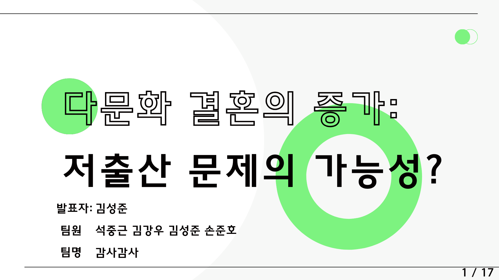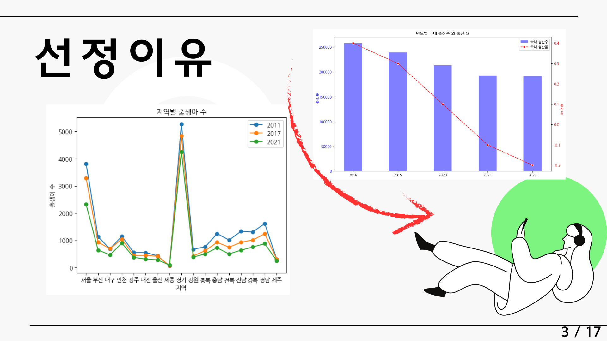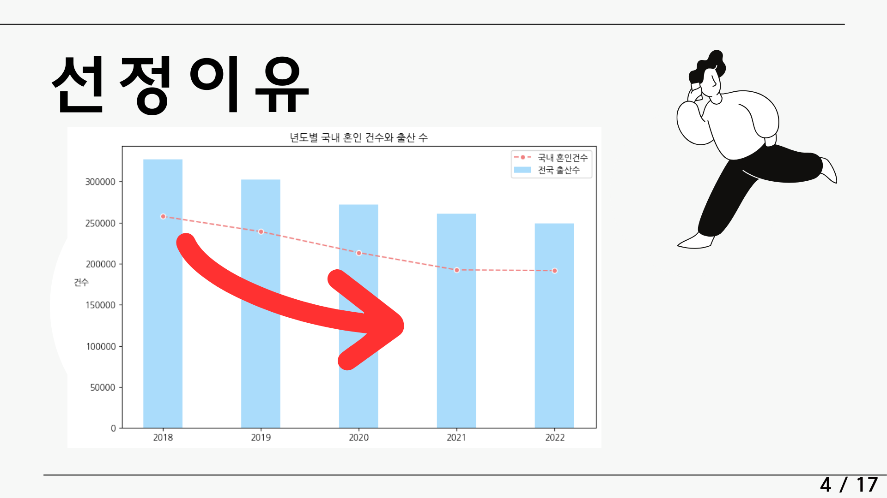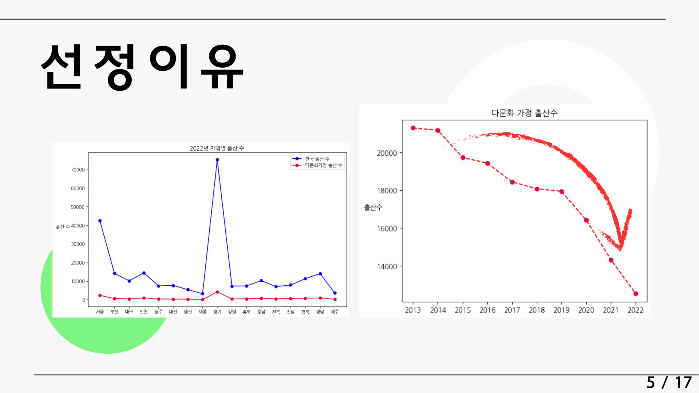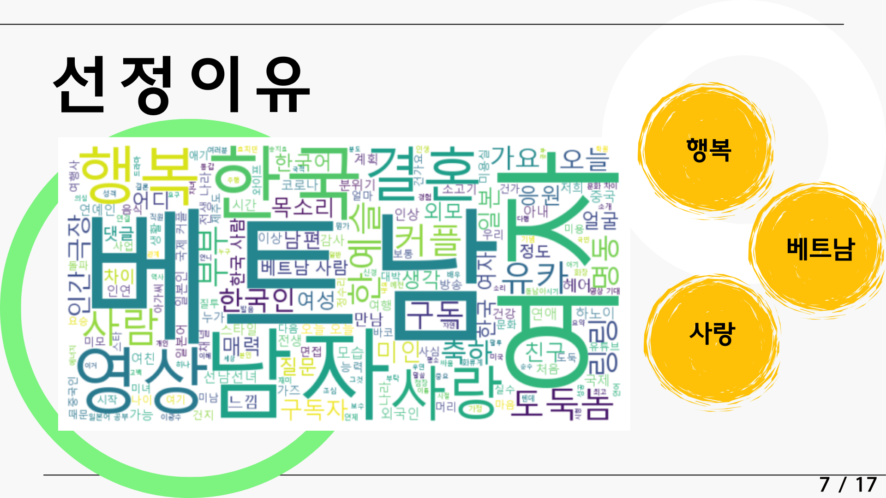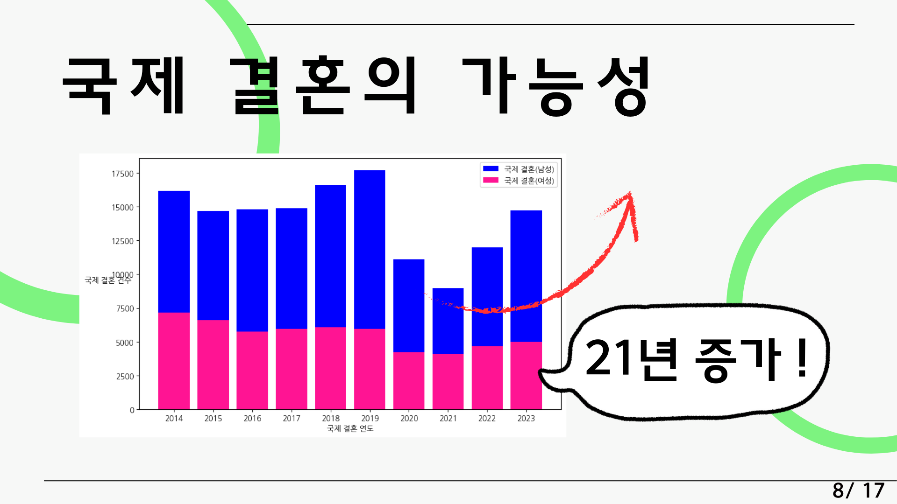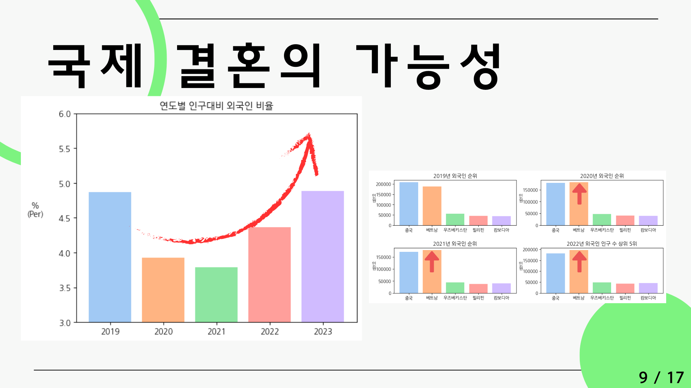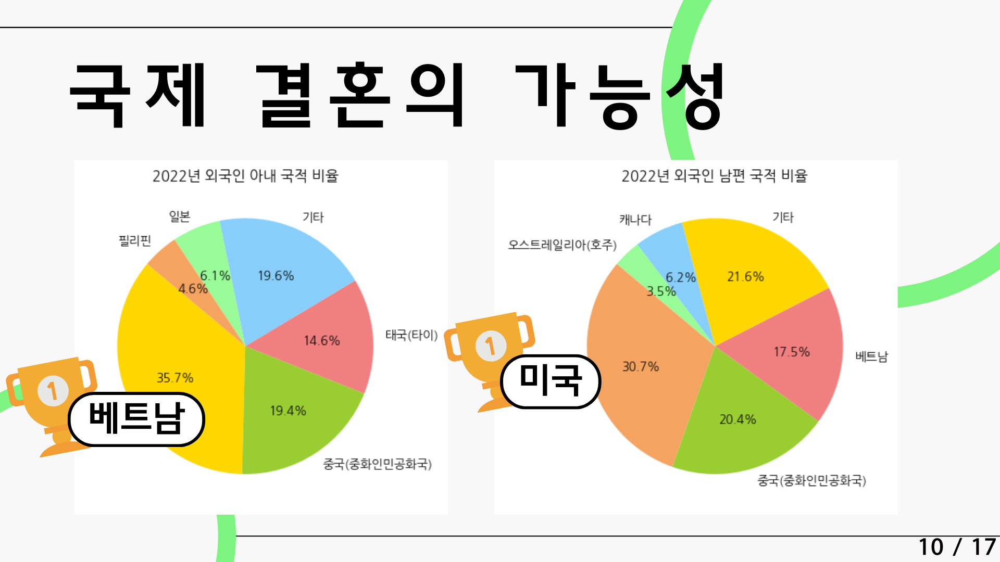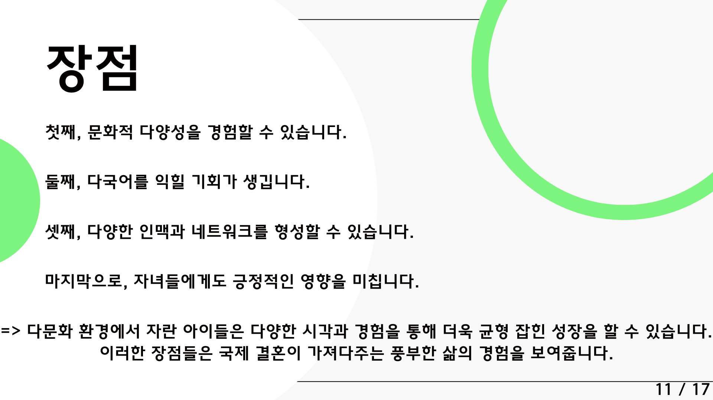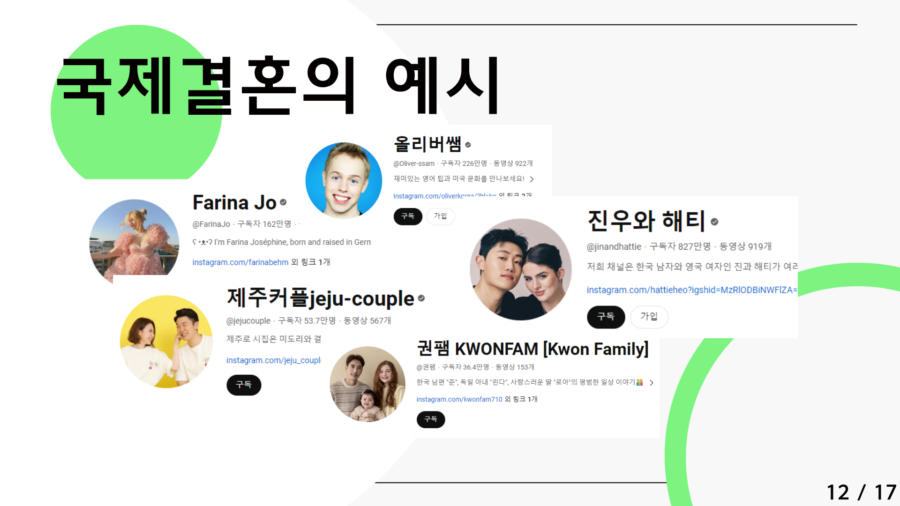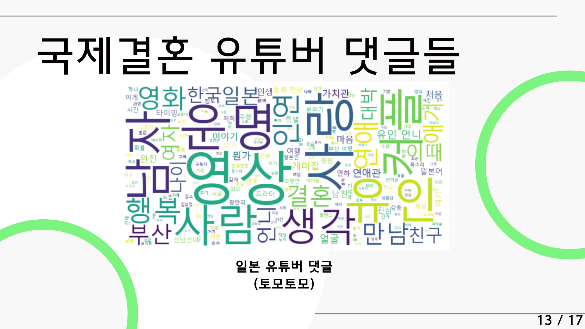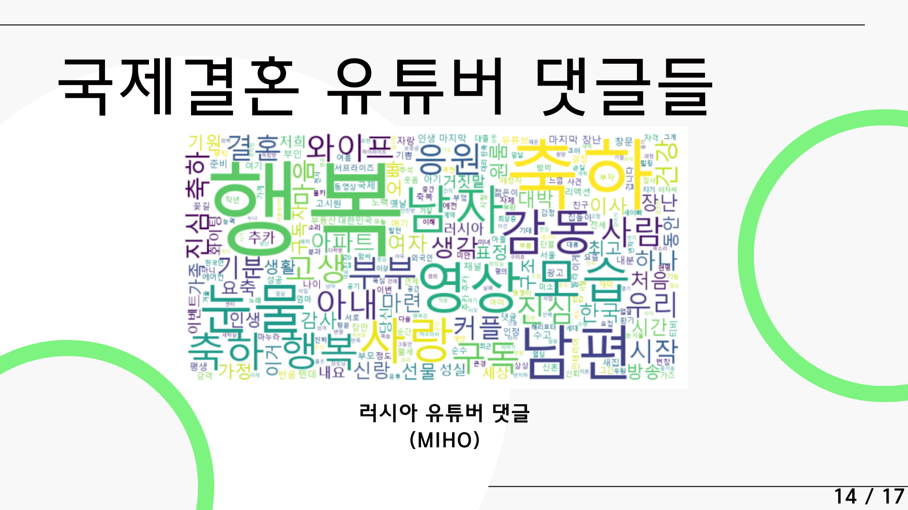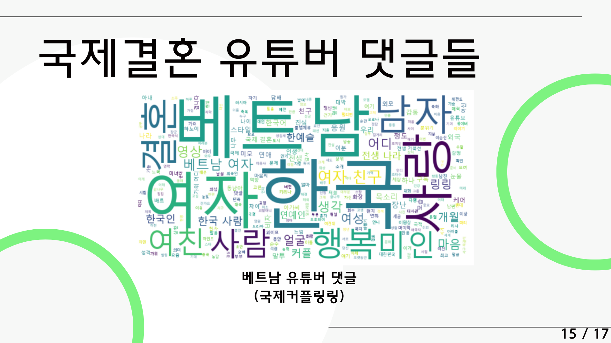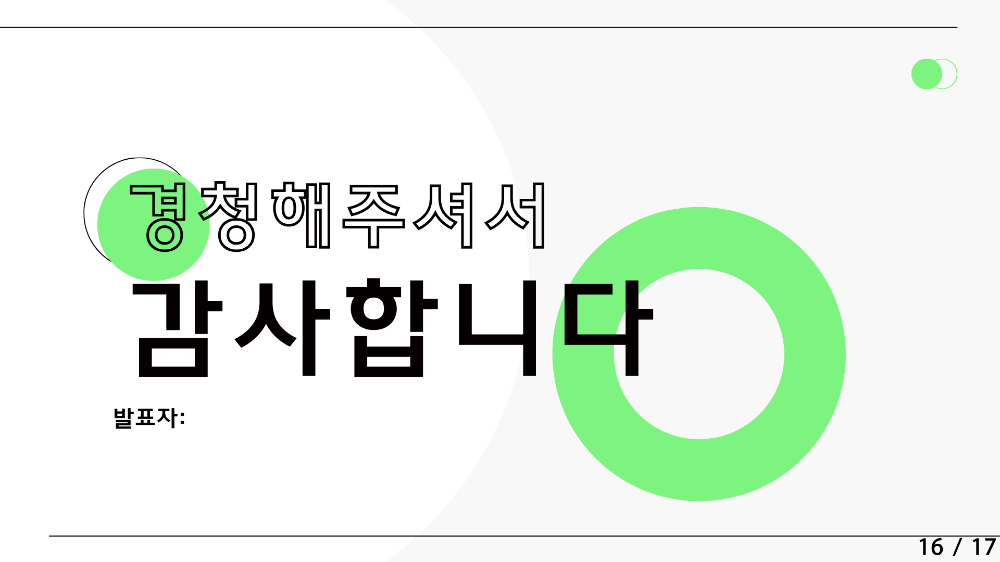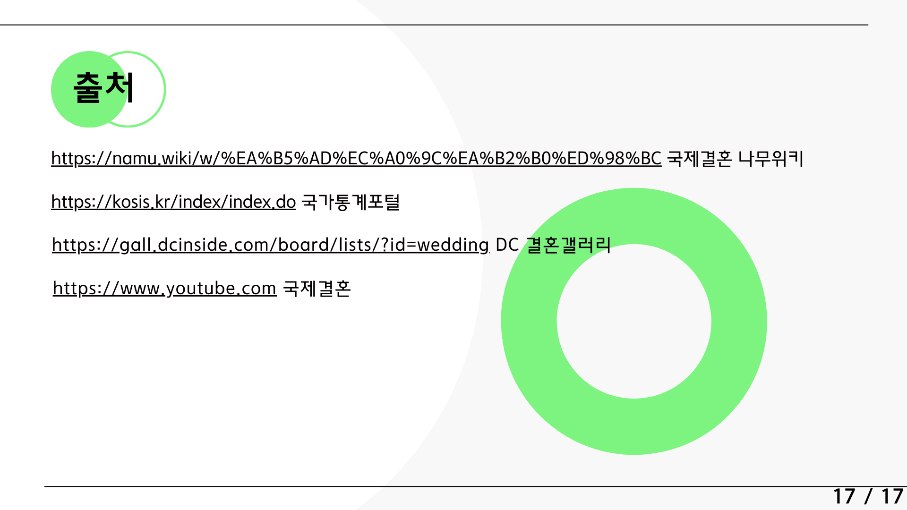
